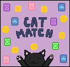

# Cat Match
Ohio State University ENGR 1181.01 Autumn 2024 SDP entry made by Group A in MATLAB

Winning entry of the ENGR 1181 Category of the Autumn 2024 Fundamentals of Engineering Design Showcase hosted by the Department of Engineering Education

Version November 22 2024

## Setup
1. You must first have MATLAB already installed. Currently not confirmed to work with Octave
2. Download and ensure all files are in the same folder
3. Open and/or run **`map_generation.m`**
## Story
The sly grey dogs have taken all the dabloons! You, the heroic black cat, must fight the sly grey dogs by beating each of them in a series of **memory matching games**.

Defeat all the sly grey dogs to win!
## Gameplay
- Travel around the world and find the grey dogs. Go next to them and interact with them. You will have to engage in card warfare with them.
- During your turn, you must chose two *matching*, *unflipped* cards in order to increase your score.
- The enemy will always take its turn after yours.
- You must correctly match more cards (get a higher score) than the enemy in order to win the battle.
- If you lose or the match ends with a tie, you will lose a life.
- You start out with two lives. Once you have zero lives, the game ends.
## Controls
**NOTE: DO NOT DIRECTLY CLOSE THE WINDOW AT ANY GIVEN TIME**
### Startup
- `q` to quit the game
- `p` to play the game
### Main controls
- Arrow keys to move
- `t` to interact with NPC if standing directly next to them
- `q` to quit
### Card game controls
- Move the mouse to move the cursor
- Click the left or right mouse button to choose one card
- `ESC` key to forfeit the game **during your turn**
# Credits
## Staff
- `Connor Levak`: Story, writing, movement mechanics, map graphics
- `David Y. Liu`: Card game mechanics, logic programming
- `Morgan M. Hallett`: Spritework and sprite design
- `Saumil Srivastava`: CPU player/enemy logic programming
- `Matthew M. VanEtten`: Title screen programming, map graphics
## Special Thanks
- Dr. Shukufe Rahman
- All UTAs of ENGR 1181.01 Section (6421)
- The UTA who helped us during Open Lab meetings
- All the test players
- Autumn 2024 Fundamentals of Engineering Design Showcase staff and judges
- and you...
## LICENSE FOR SIMPLE GAME ENGINE
Original game documentation: copyright (c) 2014, Kathleen Ossman and Gregory Bucks.
Updated to include the Simple Game Engine: copyright (c) 2019, Jonathan Brown
All rights reserved.

Redistribution and use in source and binary forms, with or without
modification, are permitted provided that the following conditions are
met:

    * Redistributions of source code must retain the above copyright
      notice, this list of conditions and the following disclaimer.
    * Redistributions in binary form must reproduce the above copyright
      notice, this list of conditions and the following disclaimer in
      the documentation and/or other materials provided with the distribution

THIS SOFTWARE IS PROVIDED BY THE COPYRIGHT HOLDERS AND CONTRIBUTORS "AS IS"
AND ANY EXPRESS OR IMPLIED WARRANTIES, INCLUDING, BUT NOT LIMITED TO, THE
IMPLIED WARRANTIES OF MERCHANTABILITY AND FITNESS FOR A PARTICULAR PURPOSE
ARE DISCLAIMED. IN NO EVENT SHALL THE COPYRIGHT OWNER OR CONTRIBUTORS BE
LIABLE FOR ANY DIRECT, INDIRECT, INCIDENTAL, SPECIAL, EXEMPLARY, OR
CONSEQUENTIAL DAMAGES (INCLUDING, BUT NOT LIMITED TO, PROCUREMENT OF
SUBSTITUTE GOODS OR SERVICES; LOSS OF USE, DATA, OR PROFITS; OR BUSINESS
INTERRUPTION) HOWEVER CAUSED AND ON ANY THEORY OF LIABILITY, WHETHER IN
CONTRACT, STRICT LIABILITY, OR TORT (INCLUDING NEGLIGENCE OR OTHERWISE)
ARISING IN ANY WAY OUT OF THE USE OF THIS SOFTWARE, EVEN IF ADVISED OF THE
POSSIBILITY OF SUCH DAMAGE.
